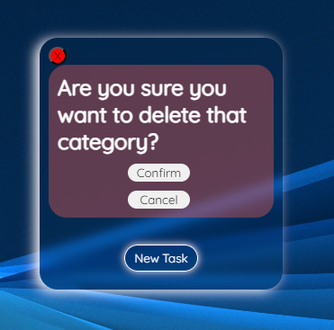

# Task Tracker

Task Tracker is a website that allows you to get a better management of the differents tasks, for professionals or private usage. It's built using Javascript, HTML & CSS. This website is fully responsive, it allows users to create their own categories, their own tasks, and to mark them as complete or delete them.

-Live Website:https://tlalexandre.github.io/TaskTracker/

## Features 

### Existing Features

- __The Task Tracker Logo and Heading__
- Featured at the top of the page, the Task Tracker Logo and Heading is easy to see for the user. Upon viewing the page, the user will be able to see the name of the website, and understand its purpose by seeing the Logo. It also contains simple instructions on how to use the website. 
-By clicking on the Get Started button, the user is redirected on the Category and Task Area. 

- __The Category Area__
  
    -__Category Creation__
        -This area will allow the user to create categories. The user will be able to easily see the icon to create a new category, and a subtitle is provided to guide the user.
        -The user will be able to personalise the name of his category, by entering the name wanted in the input when he creates a new category.

    

    -__Category Completion__
        -By double clicking on the category, the user can delete a category. This will delete all the tasks inside the category as well. 
        -The user have to confirm the deletion of the category by clicking on the Confirm button, to avoid any missclick.
        -If the user clicks on the Cancel button, then the original title is displayed again. 

    

- __The Task Section__
  
    -__Task Creation__
        -This area allow the user to create personalised tasks inside each category. The user will be able to easily create tasks by clicking on the New Task button.

    

    -__Task Completion__
        -By clicking a single time on the tasks, the user will be able to tell that a task has been completed as the background of the task will turn green. 

    

    -__Task Deletion__
        -By double clicking on the task, the user can delete it. To avoid any click error, the user will have to confirm the deletion by clicking on the "V" button, or the "X" one to restore the task as it was. 

    

- __Data Storage__

    -__How is the Data saved?__
        -To save the different categories and tasks created by the user, I used the local storage of the browser.
        -Whenever a new category or task is created, its data is added in the local storage, in an array. 
        -Whenever the user deletes a category or a task, the data is removed from the array they belong to.
        -On every action, the data is saved, this allows the user to have a dynamic website.
        -One array contains a list of the differents categories, and each task is in an array that belongs to the category where the task has been created.
        
    -__How is the Data loaded?__
        -When you open the website, the data in the local storage will be retrieve and the program will run through the differents arrays to display the correct information. 

    

### Features Left to Implement

- In the future, a great feature to add would be an agenda that would sort the differents tasks through the days of the month, regardless of their categories.
-For this feature to be implemented, I would need to add an input for the hour on top of the one for the date. 
-I would also need an algorithm that would sort the tasks chronologically. 

## Testing 

I have tested the website on differents browsers: Chrome, Opera and Mozilla Firefox.
I checked the responsive of the website on differents devices, a desktop computer, a Google Pixel 6 and an Ipad Mini

### Validator Testing 

- HTML
    - No errors were returned when passing through the official [W3C validator](https://validator.w3.org/nu/?doc=https%3A%2F%2Ftlalexandre.github.io%2FTaskTracker%2F)
- CSS
    - No errors were found when passing through the official [(Jigsaw) validator](http://jigsaw.w3.org/css-validator/validator?lang=en&profile=css3svg&uri=https%3A%2F%2Ftlalexandre.github.io%2FTaskTracker%2F&usermedium=all&vextwarning=&warning=1)
- JavaScript
    - No errors were found when passing through the official [Jshint validator](https://jshint.com/)
      - The following metrics were returned: 
      - There are 33 functions in this file.
      - Function with the largest signature takes 2 arguments, while the median is 1.
      - Largest function has 19 statements in it, while the median is 3.
      - The most complex function has a cyclomatic complexity value of 6 while the median is 1.

### Unfixed Bugs

You will need to mention unfixed bugs and why they were not fixed. This section should include shortcomings of the frameworks or technologies used. Although time can be a big variable to consider, paucity of time and difficulty understanding implementation is not a valid reason to leave bugs unfixed. 

## Deployment

- The site was deployed to GitHub pages. The steps to deploy are as follows: 
  - In the GitHub repository, navigate to the Settings tab 
  - From the source section drop-down menu, select the Master Branch
  - Once the master branch has been selected, the page will be automatically refreshed with a detailed ribbon display to indicate the successful deployment. 

The live link can be found here - https://tlalexandre.github.io/TaskTracker/

## Credits 

In this section you need to reference where you got your content, media and extra help from. It is common practice to use code from other repositories and tutorials, however, it is important to be very specific about these sources to avoid plagiarism. 

You can break the credits section up into Content and Media, depending on what you have included in your project. 

### Content 

- The text for the Home page was taken from Wikipedia Article A
- Instructions on how to implement form validation on the Sign Up page was taken from [Specific YouTube Tutorial](https://www.youtube.com/)
- The icons in the footer were taken from [Font Awesome](https://fontawesome.com/)

### Media

- The photos used on the home and sign up page are from This Open Source site
- The images used for the gallery page were taken from this other open source site

Congratulations on completing your Readme, you have made another big stride in the direction of being a developer! 

## Other General Project Advice

Below you will find a couple of extra tips that may be helpful when completing your project. Remember that each of these projects will become part of your final portfolio so it’s important to allow enough time to showcase your best work! 

- One of the most basic elements of keeping a healthy commit history is with the commit message. When getting started with your project, read through [this article](https://chris.beams.io/posts/git-commit/) by Chris Beams on How to Write  a Git Commit Message 
  - Make sure to keep the messages in the imperative mood 

- When naming the files in your project directory, make sure to consider meaningful naming of files, point to specific names and sections of content.
  - For example, instead of naming an image used ‘image1.png’ consider naming it ‘landing_page_img.png’. This will ensure that there are clear file paths kept. 

- Do some extra research on good and bad coding practices, there are a handful of useful articles to read, consider reviewing the following list when getting started:
  - [Writing Your Best Code](https://learn.shayhowe.com/html-css/writing-your-best-code/)
  - [HTML & CSS Coding Best Practices](https://medium.com/@inceptiondj.info/html-css-coding-best-practice-fadb9870a00f)
  - [Google HTML/CSS Style Guide](https://google.github.io/styleguide/htmlcssguide.html#General)

Getting started with your Portfolio Projects can be daunting, planning your project can make it a lot easier to tackle, take small steps to reach the final outcome and enjoy the process! 